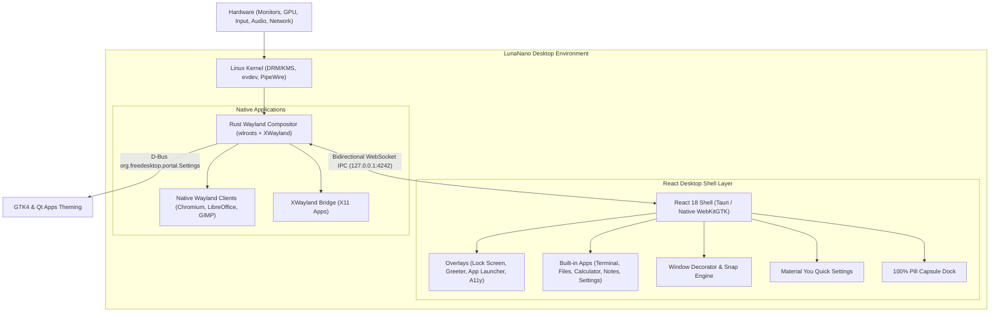

# LunaNano 🌙

<p align="center">
  
</p>

<p align="center">
  <strong>Ultra-lightweight aesthetic Standalone Wayland Desktop Shell built with React, TypeScript & Material You 3, powered by a high-performance Rust compositor with XWayland support.</strong>
</p>

<p align="center">
  <a href="LICENSE"></a>
  
  
  
  
  
</p>

<p align="center">
  <strong>English</strong> | <a href="README_RU.md">Русский</a>
</p>

---

## 🌟 Overview

**LunaNano** is a 100% standalone, full-screen desktop environment designed as a modern, minimalist alternative to GNOME, KDE, and Hyprland. 

> [!IMPORTANT]
> **Zero Browser Dependency**: LunaNano does **NOT** run inside a web browser and does not require Google Chrome, Chromium, or Firefox. Upon launch, a dedicated native binary (`lunanano-shell` / `lunanano-standalone-runner`) displays the React interface directly as a fullscreen borderless Wayland layer surface on the physical display.

### 🏛️ System Architecture



---

## 🚀 Key Features

### 🖥️ Bottom Dock (100% Pill Capsules)
- **Modular Floating Capsules**: Completely rounded pill containers with frosted glass acrylic blur and Material You 3 elevation.
- **macOS Gaussian Magnification**: Smooth bell-curve hover magnification powered by `framer-motion` spring physics.
- **Genie Minimize Animation**: Windows smoothly morph and collapse directly into their dock icon capsule upon minimization.
- **Indicators & Badges**: Running dot/pill indicators, unread notification counter badges, and archive operation progress rings.
- **Media Player Capsule**: Real-time 3-band equalizer visualizer, track title marquee, and play/pause controls.
- **Quick Settings & Status Capsule**: Combined capsule displaying Wi-Fi/LAN, Bluetooth, PipeWire volume, battery status, and clock/date.
- **Auto-Hide Engine**: Smoothly slides offscreen when `dock.autoHide` is enabled and reappears when cursor approaches the bottom screen trigger strip.
- **Mouse & Touch Actions**:
  - **LMB**: Open / Minimize / Focus.
  - **RMB**: Context menu (New Window, Pin/Unpin, Close All).
  - **MMB (Middle Click)**: Spawn new application instance.
  - **Scroll Wheel**: Switch between open windows of the same app.
  - **Drag & Drop**: Reorder dock capsules smoothly.

---

### 🎛️ Material You Quick Settings Control Center
Clicking the system capsule opens the slide-up Quick Settings panel:
- **Interactive M3 Toggle Pills**: Wi-Fi, Bluetooth, Dark/Light Mode, Do Not Disturb, Screenshot, and Night Light.
- **PipeWire Volume Slider**: Master volume control with mute toggle.
- **Display Brightness Slider**: Hardware monitor backlight control (`brightnessctl`).
- **Power Profiles & Battery Health**: Performance, Balanced, and Eco chips with real-time CPU (`/proc/stat`) and RAM (`/proc/meminfo`) usage.
- **Session Actions**: Screen Lock, full system preferences, and reboot/poweroff controls.

---

### 📦 Built-in React Applications

All internal tools run seamlessly within the unified React canvas routing without launching separate native windows:

1. **Terminal (`TerminalApp`)**:
   - Multi-tab support (`+` new tab, close tab) for concurrent PTY sessions.
   - Connected directly to Rust `portable-pty` over WebSocket (`pty:write`, `pty:resize`, `pty:data`).
   - Integrated action toolbar: font scaling (`A-` / `A+`), clear screen, and command clipboard.
   - Live status bar: active shell path (`/bin/bash`), geometry (cols × rows), and live PTY connection dot.
2. **Calculator (`CalculatorApp`)**:
   - Standard and Scientific mode drawer (`sin`, `cos`, `tan`, `√`, `xʸ`, `ln`, `log`, `π`, `e`, `1/x`).
   - Calculation history tape with recall, memory registers (`MC`, `MR`, `M+`, `M-`).
   - Tactile Material You pill keypad with haptic feedback.
3. **File Explorer (`ExplorerApp`)**:
   - Real Linux filesystem operations via native IPC bridge.
   - Interactive breadcrumb navigation (click any path segment to jump).
   - Storage capacity meter in sidebar (used/free ext4 disk space).
   - Rich file type badges (code, archives, images, documents).
   - High-speed archive compression and extraction for `.zip`, `.tar.gz`, and `.7z` with real-time M3 progress dialogs.
4. **Notepad (`NotepadApp`)**:
   - Split-pane and live-preview Markdown editor powered by `marked`.
   - Markdown formatting toolbar: Bold, Italic, Headings, Code block, Quote, List, Links.
   - Live document statistics: Word count, character count, and estimated reading time.
   - Automatic background saving into `~/.local/share/lunanano/notes/`.
   - Tag taxonomy and export to `.md` or `.html`.
5. **Settings (`SettingsApp` — 21 Comprehensive Sections)**:
   - **Appearance**: Live dynamic wallpaper gallery with MCU color extraction, custom wallpaper URL/gradient, dark/light/auto mode, UI scale slider, screen corner radius, smooth animations, and UI sound effects.
   - **Dock, Workspaces, Default Apps, Terminal, Calculator, Explorer, Notepad, Notifications, Sound (PipeWire per-app mixer), Network (Wi-Fi & BT), Power, Date & Time (NTP), Keyboards, Users, Privacy, Updates, Shortcuts, Accessibility, About, and Profile Backup/Reset**.
6. **Launcher (`LauncherApp`)**:
   - Fullscreen app launcher overlay with fuzzy search and categorized freedesktop `.desktop` applications.

---

### 🌐 System Integrations
- **Audio**: PipeWire & WirePlumber master volume and per-app audio stream sliders.
- **Brightness**: `brightnessctl` backlight control.
- **Networking**: `nmcli` Wi-Fi scanning and connection.
- **Bluetooth**: `bluetoothctl` pairing and device management.
- **Power**: `power-profiles-daemon` (`power-saver`, `balanced`, `performance`).
- **Notifications**: Mako / D-Bus notification daemon with React toast overlay.
- **Clipboard**: `wl-clipboard` (`wl-copy`, `wl-paste`) with history manager.
- **Captures**: `grim` + `slurp` for screenshots and `wf-recorder` for video recording.
- **Lock Screen**: React lock screen (`Super+L`) with clock, battery, and PIN unlock.
- **Greeter**: `greetd` login session.
- **Accessibility**: Built-in On-Screen Virtual Keyboard (EN + RU bilingual), high-contrast mode, and large text.
- **UI Sound Effects**: Procedural Web Audio API sound synthesizer (tactile clicks, genie minimize swoosh, snap pop, notification chime).

---

## ⌨️ Default Keyboard Shortcuts

| Shortcut | Action |
|---|---|
| `Super` | Open / Close Application Launcher |
| `Super + Enter` | Open Terminal |
| `Super + E` | Open File Explorer |
| `Super + L` | Lock Screen |
| `Super + Q` | Close Active Window |
| `Super + M` | Minimize Active Window |
| `Super + Up` | Maximize / Snap Top |
| `Super + Down` | Minimize Active Window |
| `Super + Left` | Snap Window Left (50% screen) |
| `Super + Right` | Snap Window Right (50% screen) |
| `Alt + Tab` | Window Switcher Carousel |

---

## 🛠️ Installation & Setup

### 1. Install from Debian Package (.deb)

LunaNano installs as a standalone display session:

```bash
sudo dpkg -i artifacts/lunanano_0.1.0_amd64.deb
sudo apt-get install -f
```

### 2. Building from Source

#### Dependencies
- Linux (Ubuntu 24.04, Debian 12+, Arch Linux, or Fedora)
- Rust 1.75+ (`rustc`, `cargo`)
- Node.js 18+ and `npm`
- System packages: `libwayland-dev`, `wayland-protocols`, `libxkbcommon-dev`, `xwayland`, `pipewire`, `wireplumber`, `brightnessctl`, `network-manager`, `bluez`, `power-profiles-daemon`, `wl-clipboard`, `grim`, `slurp`, `wf-recorder`, `libwebkit2gtk-4.1-dev` (or `libwebkit2gtk-4.0-dev`)

#### Build Steps
```bash
# 1. Clone repository
git clone https://github.com/superluna/lunaNano.git
cd lunaNano

# 2. Build React Shell
npm ci
npm run build

# 3. Build Rust Wayland Compositor
cargo build --release -p lunanano-compositor

# 4. Create Debian Package
./packaging/build-deb.sh
```

---

## 🚀 Running LunaNano

### From Display Manager (GDM, SDDM, greetd, LightDM)
Select **LunaNano** from the session list on your login screen.

### From Virtual Console (TTY)
```bash
lunanano-session
```
The session initializes the Rust compositor, starts the IPC server on port `4242`, and immediately launches the standalone native shell on the screen.

---

## ⚙️ Configuration Format

Settings are saved in `~/.config/lunanano/settings.json`. The compositor monitors this file and hot-reloads changes dynamically across the shell without requiring a restart.

---

## 📄 License

This project is licensed under the **GNU General Public License v3.0** (GPLv3). See the [LICENSE](LICENSE) file for details.
