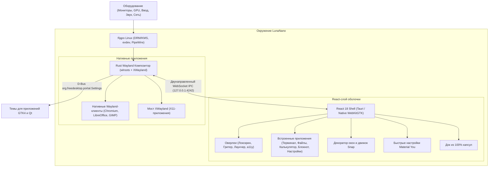

# LunaNano 🌙

<p align="center">
  
</p>

<p align="center">
  <strong>Сверхлегкая эстетичная автономная десктоп-оболочка для Wayland на React, TypeScript и Material You 3, работающая на высокопроизводительном Rust-композиторе с поддержкой XWayland.</strong>
</p>

<p align="center">
  <a href="LICENSE"></a>
  
  
  
  
  
</p>

<p align="center">
  <a href="README.md">English</a> | <strong>Русский</strong>
</p>

---

## 🌟 О проекте

**LunaNano** — это на 100% самостоятельное, полноэкранное десктопное окружение (замена GNOME, KDE и Hyprland), в котором пользователь видит исключительно React-интерфейс без устаревших нативных панелей.

> [!IMPORTANT]
> **Полная независимость от веб-браузеров**: LunaNano **НЕ** работает внутри браузера и не требует установки Chrome, Chromium или Firefox. При запуске сессии нативный бинарник (`lunanano-shell` / `lunanano-standalone-runner`) отображает React-интерфейс напрямую как полноэкранную Wayland-поверхность на физическом дисплее.

### 🏛️ Архитектура системы



---

## 🚀 Ключевые возможности

### 🖥️ Нижний док (100% капсулы)
- **Модульные плавающие капсулы**: Отдельные контейнеры со 100% скруглением, акриловым размытием и M3-элевацией.
- **Гауссово масштабирование (macOS-style)**: Плавное увеличение иконок при наведении курсора на физике пружин (`framer-motion`).
- **Анимация Genie**: Окна плавно сворачиваются и морфятся прямо в капсулу своей иконки в доке.
- **Индикаторы и бейджи**: Точки запущенных приложений, счётчики непрочитанных уведомлений, кольца прогресса операций.
- **Капсула медиаплеера**: Анимированный 3-полосный эквалайзер, бегущая строка названия трека, кнопки паузы/воспроизведения.
- **Капсула системного статуса**: Уровень громкости PipeWire, статус Wi-Fi/LAN, процент заряда батареи и часы с датой.
- **Автоматическое скрытие**: Док плавно уезжает за экран при включении `dock.autoHide` и появляется при поднесении курсора к нижней кромке экрана.
- **Управление мышью и тачем**:
  - **ЛКМ**: Открыть / Свернуть / Сфокусировать.
  - **ПКМ**: Контекстное меню (Новое окно, Закрепить/Открепить, Закрыть все).
  - **СКМ (Колёсико)**: Создать новый экземпляр приложения.
  - **Колесо мыши**: Быстрое переключение между окнами одного приложения.
  - **Drag & Drop**: Перестановка капсул в доке.

---

### 🎛️ Панель быстрых настроек (Control Center)
Открывается при нажатии на системную капсулу:
- **Интерактивные переключатели Material You**: Wi-Fi, Bluetooth, Dark/Light Mode, Do Not Disturb, Скриншот, Night Light.
- **Слайдер громкости PipeWire**: Мастер-громкость с кнопкой выключения звука.
- **Слайдер яркости подсветки**: Аппаратное управление подсветкой дисплея (`brightnessctl`).
- **Профили питания и батарея**: Режимы Performance, Balanced и Eco с отображением реальной нагрузки CPU (`/proc/stat`) и RAM (`/proc/meminfo`).
- **Действия сессии**: Блокировка экрана, переход в полные настройки, перезагрузка и выключение.

---

### 📦 Встроенные React-приложения

Все внутренние приложения работают внутри общего роутинга оболочки без создания лишних окон операционной системы:

1. **Терминал (`TerminalApp`)**:
   - Поддержка вкладок (`+` создать, закрыть) для параллельных сессий PTY.
   - Прямое подключение к Rust `portable-pty` по WebSocket (`pty:write`, `pty:resize`, `pty:data`).
   - Панель инструментов: изменение размера шрифта (`A-` / `A+`), очистка терминала, буфер обмена.
   - Статус-бар: путь шелла (`/bin/bash`), геометрия (колонки × строки), индикатор активного PTY.
2. **Калькулятор (`CalculatorApp`)**:
   - Обычный и научный режим (`sin`, `cos`, `tan`, `√`, `xʸ`, `ln`, `log`, `π`, `e`, `1/x`).
   - Лента истории расчётов с возможностью копирования и вставки, память (`MC`, `MR`, `M+`, `M-`).
   - Тактильная клавиатура Material You с цветовой дифференциацией операторов.
3. **Проводник файлов (`ExplorerApp`)**:
   - Реальные файловые операции Linux через нативный мост IPC.
   - Интерактивные хлебные крошки (клик по любому сегменту пути мгновенно открывает папку).
   - Индикатор ёмкости накопителя в боковой панели (свободно/занято на ext4).
   - Бейджи типов файлов (исходный код, архивы, изображения, документы).
   - Упаковка и распаковка `.zip`, `.tar.gz`, `.7z` с M3 прогресс-барами.
4. **Блокнот (`NotepadApp`)**:
   - Редактор Markdown с поддержкой сплит-режима и живого рендера (`marked`).
   - Панель форматирования: жирный, курсив, заголовки, блоки кода, цитаты, списки, ссылки.
   - Статистика в реальном времени: счётчик слов, символов, примерное время чтения.
   - Автосохранение в `~/.local/share/lunanano/notes/`.
   - Тегирование заметок и экспорт в `.md` или `.html`.
5. **Настройки (`SettingsApp` — все 21 раздел)**:
   - **Внешний вид**: Галерея обоев с живой MCU-генерацией палитры, пользовательский URL/градиент, выбор темной/светлой темы, масштаб интерфейса, скругление углов экрана, анимации и звуки.
   - **Док, Рабочие столы, Приложения по умолчанию, Терминал, Калькулятор, Проводник, Блокнот, Уведомления, Звук (микшер PipeWire per-app), Сеть (Wi-Fi и Bluetooth), Питание, Дата и время (NTP), Раскладки клавиатуры, Пользователи, Приватность, Обновления, Хоткеи, Доступность (a11y), О системе, Резервная копия и Сброс**.
6. **Лаунчер (`LauncherApp`)**:
   - Полноэкранный лаунчер с поиском и классификацией системных `.desktop` приложений.

---

### 🌐 Системная интеграция
- **Звук**: PipeWire и WirePlumber — мастер-громкость и индивидуальные аудиопотоки приложений.
- **Яркость**: `brightnessctl` для аппаратной регулировки подсветки.
- **Сеть**: `nmcli` для сканирования и подключения к Wi-Fi.
- **Bluetooth**: `bluetoothctl` для спаривания и подключения устройств.
- **Питание**: `power-profiles-daemon` (`power-saver`, `balanced`, `performance`).
- **Уведомления**: D-Bus демон с всплывающими тостами в React-слое.
- **Буфер обмена**: `wl-clipboard` (`wl-copy`, `wl-paste`) с историей.
- **Скриншоты и запись**: `grim` + `slurp` для скриншотов, `wf-recorder` для видеозаписи.
- **Экран блокировки**: Экран блокировки (`Super+L`) с часами, батареей и PIN-кодом.
- **Экран входа**: Сессия `greetd`.
- **Специальные возможности (a11y)**: Экранная виртуальная клавиатура (RU + EN), режим высокой контрастности, крупный шрифт.
- **Звуки интерфейса**: Процедурный синтезатор Web Audio API (тактильные клики, звук сворачивания genie, щелчок snap, звук уведомлений).

---

## ⌨️ Горячие клавиши по умолчанию

| Сочетание | Действие |
|---|---|
| `Super` | Открыть / Закрыть лаунчер приложений |
| `Super + Enter` | Открыть Терминал |
| `Super + E` | Открыть Проводник |
| `Super + L` | Заблокировать экран |
| `Super + Q` | Закрыть активное окно |
| `Super + M` | Свернуть активное окно |
| `Super + Вверх` | Развернуть на весь экран |
| `Super + Вниз` | Свернуть активное окно |
| `Super + Влево` | Прикрепить к левой половине (50% экрана) |
| `Super + Вправо` | Прикрепить к правой половине (50% экрана) |
| `Alt + Tab` | Карусель переключения окон |

---

## 🛠️ Установка и запуск

### 1. Установка из Debian-пакета (.deb)

LunaNano устанавливается как самостоятельная сессия дисплейного менеджера:

```bash
sudo dpkg -i artifacts/lunanano_0.1.0_amd64.deb
sudo apt-get install -f
```

### 2. Сборка из исходного кода

#### Зависимости
- Linux (Ubuntu 24.04, Debian 12+, Arch Linux, Fedora)
- Rust 1.75+ (`rustc`, `cargo`)
- Node.js 18+ и `npm`
- Системные пакеты: `libwayland-dev`, `wayland-protocols`, `libxkbcommon-dev`, `xwayland`, `pipewire`, `wireplumber`, `brightnessctl`, `network-manager`, `bluez`, `power-profiles-daemon`, `wl-clipboard`, `grim`, `slurp`, `wf-recorder`, `libwebkit2gtk-4.1-dev` (или `libwebkit2gtk-4.0-dev`)

#### Шаги сборки
```bash
# 1. Клонирование репозитория
git clone https://github.com/superluna/lunaNano.git
cd lunaNano

# 2. Сборка React Shell
npm ci
npm run build

# 3. Сборка Wayland-композитора на Rust
cargo build --release -p lunanano-compositor

# 4. Создание .deb пакета
./packaging/build-deb.sh
```

---

## 🚀 Запуск LunaNano

### Через дисплейный менеджер (GDM, SDDM, greetd, LightDM)
Выберите **LunaNano** в списке сессий на экране входа.

### Из виртуальной консоли (TTY)
```bash
lunanano-session
```
Сессия запустит Rust-композитор, откроет IPC-сокет на порту `4242` и развернет автономную нативную оболочку на весь экран.

---

## ⚙️ Формат настроек

Настройки сохраняются в формате JSON по пути `~/.config/lunanano/settings.json`. Композитор отслеживает изменения файла и выполняет горячую перезагрузку (hot reload) без перезапуска окружения.

---

## 📄 Лицензия

Проект распространяется под свободной лицензией **GNU General Public License v3.0** (GPLv3). Подробности в файле [LICENSE](LICENSE).
